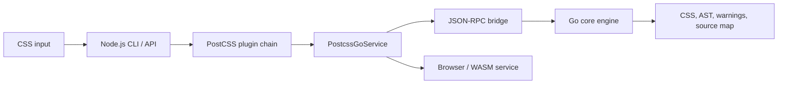
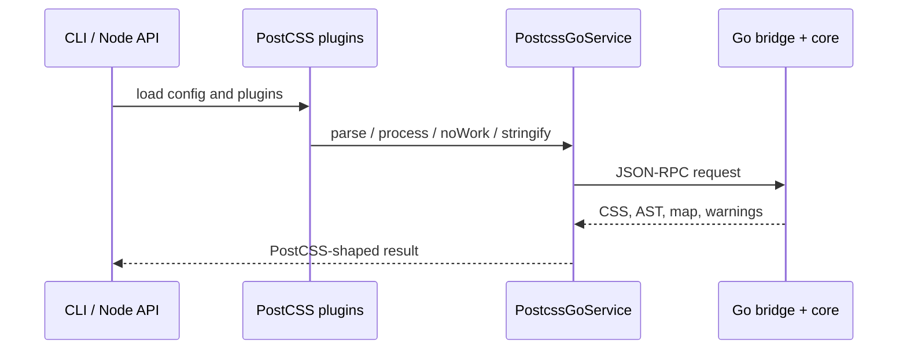

# Architecture

A fast Go CSS engine behind a PostCSS-compatible JavaScript surface. The Go core owns the hot path; Node and browser packages own ecosystem integration.

## System overview



- **Go core** — parse, canonical AST operations, stringify, warnings, source maps
- **Node.js packages** — public API, CLI, plugin loading, process management, and the synchronous AST facade required by JavaScript plugins
- **Bridge** — serialize requests and AST results between JavaScript and Go
- **Browser / WASM** — same service contract as Node, via a Worker and Go WASM

## Processing pipeline

```text
CSS → tokenizer → parser → AST → plugins → stringifier → Result
```

`postcss.New(...).Process(css, options)` parses input, runs plugin hooks (`Prepare` → `Once` → enter/exit visitors → `OnceExit`), then stringifies. Source-map generation, previous-map composition, and annotation emission are Go-owned. Errors stop the run; warnings accumulate on `Result.Messages`.

## AST model

Five node kinds: `Root`, `Rule`, `AtRule`, `Declaration`, `Comment`. Nodes share parent links, source ranges, and formatting metadata (`Raws`), so output can stay faithful to the input.

## Go packages

| Package       | Responsibility                     |
| ------------- | ---------------------------------- |
| `tokenizer`   | Lexical scanning                   |
| `parser`      | AST construction                   |
| `ast`         | Node types, mutation, traversal    |
| `processor`   | Plugin lifecycle and orchestration |
| `sourcemap`   | Inputs, locations, previous maps   |
| `stringifier` | CSS output and generated maps      |
| `result`      | CSS, root, maps, warnings          |
| `postcss`     | Public Go facade                   |

The tokenizer never builds AST nodes; the parser never runs plugins; the processor coordinates without owning tokenization or serialization.

## JavaScript bridge

```text
TypeScript service → JSON-RPC → cmd/api → jsbridge → Go facade
```

Four core operations: `parse`, `process`, `noWork`, and `stringify`. The DTO carries semantic fields, children, source locations, and `Raws` so the bridge does not silently change CSS or maps. `noWork` handles the no-plugin map path without parsing or re-stringifying CSS. `cmd/api` only wires RPC to bridge handlers.

## Node.js integration



- **service** — shared async contract
- **node** — child process, request queue; map-option normalization via `@postcss-go/shared`
- **browser** — Worker-backed service; `@postcss-go/wasm` ships the WASM assets
- **cli** — config, JS plugins, message combining, writing Go-generated CSS and maps
- **shared** — dual ESM/CJS helpers for map-option normalization, annotation callbacks, map paths, and map-mode predicates; used by core and vendored compat overrides

JavaScript stays responsible for ecosystem-facing behavior and synchronous JavaScript plugin callbacks. Go handles parse, the canonical AST implementation, process, no-work map handling, and all pipeline/plugin-result stringify and source-map generation. The TypeScript AST stringifier is only the synchronous compatibility fallback required by `Node#toString()`.

## Source maps

Ownership is split so PostCSS-shaped options stay in JavaScript while map generation stays in Go:

| Layer                   | Owns                                                                                                                                                                   |
| ----------------------- | ---------------------------------------------------------------------------------------------------------------------------------------------------------------------- |
| `@postcss-go/shared`    | Normalize `map` / `map.prev` / `map.annotation` into flat bridge flags (`mapInline`, `mapAuto`, `previousMapPath`, …); resolve annotation callbacks and map file paths |
| Node / browser / compat | Call `normalizeProcessOptions` before `process` / `noWork`; empty plugin pipelines use `noWork`                                                                        |
| Go `processor`          | Load previous maps, compose or build identity maps, clear or preserve annotations, emit inline/external `sourceMappingURL`                                             |
| Go `stringifier`        | AST stringify with optional source-map annotation stripping; raw-CSS `ClearSourceMapAnnotations` for the no-work path                                                  |

Contract notes:

- Bridge `mapInline` is optional JSON (`*bool` in Go). Omitted means unset; `false` means explicit external/no-inline. Bare Go `Map: true` with no output-mode flags defaults to inline, matching PostCSS `map: true`.
- `process` with maps off strips only `# sourceMappingURL=` comment nodes. `noWork` without maps uses the PostCSS no-work string cleaner (`/*#` comments).
- When JavaScript plugins still run first, their intermediate map may be passed to Go as `previousMap`; final annotation/inline emission remains Go-owned.

## Compatibility and performance

**Compatibility** — keep PostCSS-shaped AST and visitors; preserve formatting and source locations; carry source-map options through the processor and bridge; run upstream tests via `packages/postcss-compat`.

**Performance** — keep the core pipeline in Go; reuse one Node bridge process; measure with the fixtures in [Contributing](contributing.md).

## Testing

Tests live next to the code they protect (tokenizer, parser, AST, processor, stringifier, bridge, `@postcss-go/shared`, packages). Prefer the narrowest boundary tests first, then the broader checks from [Contributing](contributing.md).
