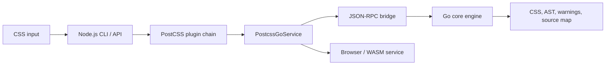
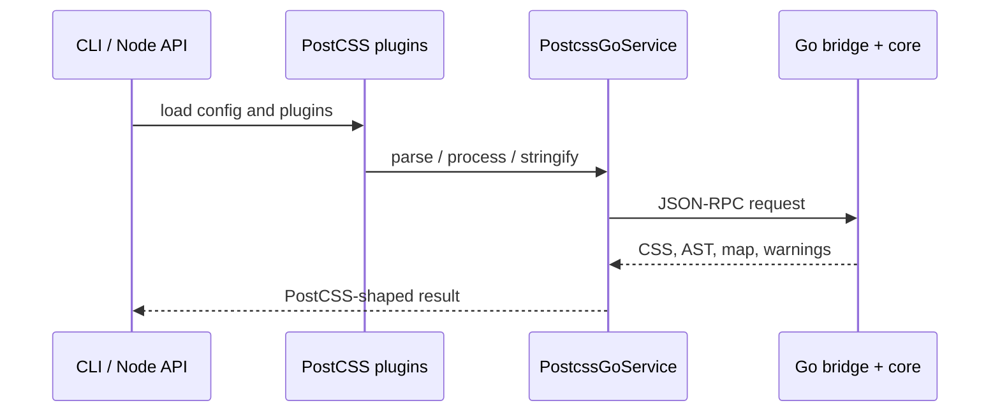

# Architecture

`postcss-go` is designed around two priorities: make the core CSS pipeline faster than PostCSS for common workloads, and remain compatible with the existing PostCSS ecosystem. The repository therefore separates the Go engine from the JavaScript integration layers while keeping the data model close to PostCSS.

## System overview

The repository has three cooperating layers:



- The Go core owns parsing, AST mutation, plugin visitor execution, stringification, warnings, and source maps.
- The Node.js packages provide the public JavaScript-facing API, CLI behavior, plugin loading, and process management.
- The bridge serializes requests and AST results so the JavaScript layer can use the Go engine without duplicating core CSS logic.
- The browser/WASM service implements the same service contract as the Node service through a classic Web Worker and a Go WASM request handler.

## Core processing pipeline

For direct Go usage, `postcss.New(...).Process(css, options)` runs the following lifecycle:

```text
CSS text
  │
  ├─ previous source-map discovery and input setup
  ▼
tokenizer
  │  emits position-aware tokens
  ▼
parser
  │  builds Root / Rule / AtRule / Declaration / Comment nodes
  ▼
AST
  │  plugins mutate the tree through visitor callbacks
  ▼
stringifier
  │  preserves formatting metadata and optionally emits a source map
  ▼
Result { CSS, Root, Map, Messages }
```

The processor executes plugins in a predictable order:

1. Parse the input and create a `Result` containing the root node.
2. Call `Plugin.Prepare` for plugins that need per-run state.
3. Call each plugin's `Once` hook.
4. Walk the AST and call node-specific enter hooks.
5. Traverse children, then call the matching exit hooks.
6. Call each plugin's `OnceExit` hook.
7. Stringify the final AST, with source-map generation when requested.

Errors from parsing, plugins, source-map handling, or stringification stop the current process and are returned to the caller. Warnings are collected on `Result.Messages` and retain plugin and source-location information when available.

## Public Go facade

`internal/postcss/postcss.go` is the narrow entry point for Go callers. It aliases the core types and exposes:

- `Parse` and `ParseWithOptions`
- `New` for constructing a processor with plugins
- `Stringify` and `StringifyWithSourceMap` behavior through processor options
- Root, rule, at-rule, declaration, comment, and input constructors
- Generic and filtered AST walkers
- Processing options for source files, output files, previous maps, annotations, and source content

The facade keeps consumers independent from most package-level implementation details. Internal packages can evolve while the facade continues to provide the PostCSS-shaped API.

## AST model

The AST is a mutable tree made of five node kinds:

| Node          | Meaning                                      | Children                                       |
| ------------- | -------------------------------------------- | ---------------------------------------------- |
| `Root`        | Document root                                | Top-level nodes                                |
| `Rule`        | Selector and block                           | Nested rules, at-rules, declarations, comments |
| `AtRule`      | At-rule name, parameters, and optional block | Optional nested nodes                          |
| `Declaration` | Property, value, and `!important` state      | None                                           |
| `Comment`     | CSS comment text                             | None                                           |

All nodes share `BaseNode`, which stores parent links, source ranges, source locations, formatting metadata, and traversal bookkeeping. Container nodes provide append, prepend, insert, remove, clone, and sibling navigation operations.

The AST deliberately keeps both semantic values and formatting information. For example, a declaration exposes normalized `Prop` and `Value` fields while `Raws` retains whitespace and other source formatting needed for faithful output.

## Module responsibilities

The Go core is split by responsibility so the hot path stays independent from integration concerns:

| Package                | Owns                                                                        | Does not own                         |
| ---------------------- | --------------------------------------------------------------------------- | ------------------------------------ |
| `internal/tokenizer`   | CSS lexical scanning and position-aware tokens                              | AST construction or plugin execution |
| `internal/parser`      | Statement classification, AST construction, source ranges, and parse errors | Plugin execution or CSS output       |
| `internal/ast`         | Node types, parent/child invariants, mutation, cloning, and traversal       | Parsing or serialization             |
| `internal/processor`   | Plugin registration, visitor lifecycle, results, and process orchestration  | Node representation or tokenization  |
| `internal/source`      | Input files, offsets, locations, source content, and previous source maps   | AST traversal or plugin behavior     |
| `internal/stringifier` | CSS output, raw formatting, and generated source maps                       | AST mutation or plugin dispatch      |
| `internal/result`      | CSS, root, maps, warnings, and active-plugin context                        | Error parsing or transport           |
| `internal/csserrors`   | Structured syntax errors with source context                                | Recovery or process orchestration    |

### Core boundaries

- The tokenizer emits tokens; it never creates AST nodes.
- The parser creates and annotates nodes; it never runs plugins.
- The AST exposes mutation and traversal primitives; it does not know whether a change came from a plugin or a caller.
- The processor coordinates the lifecycle but delegates parsing, traversal, source handling, and output to their respective packages.
- The bridge and Node.js packages depend on the public facade instead of reaching into core implementation details.

This separation makes it possible to benchmark the Go pipeline independently and to test compatibility at each boundary.

## JavaScript bridge

The bridge is a narrow transport boundary, not a second processing engine.

```text
TypeScript service -> JSON-RPC line -> cmd/api -> internal/jsbridge -> Go facade
```

`internal/jsbridge` exposes three core operations:

| Operation   | Input                              | Output                      |
| ----------- | ---------------------------------- | --------------------------- |
| `parse`     | CSS and input options              | Serialized root AST         |
| `process`   | CSS and process/source-map options | CSS, AST, map, and warnings |
| `stringify` | Serialized AST                     | CSS                         |

`NodeDTO` carries semantic fields (`selector`, `prop`, `value`, and so on), child nodes, source locations, and `Raws`. Keeping formatting and source metadata in the DTO prevents the bridge from silently changing CSS output or source-map behavior.

The server in `cmd/api` only wires `jrpc2` to the bridge handlers. It does not contain parsing or processing logic. The Node service starts it once, sends newline-delimited requests over stdin, matches responses by request ID, and rejects pending calls when the process exits.

## Node.js and CLI integration

The Node.js layer adapts the Go engine to PostCSS's JavaScript ecosystem without moving core CSS work back into JavaScript.



Responsibilities are intentionally split:

- `packages/postcss-go/src/service` defines the shared async service contract.
- `packages/postcss-go/src/node` manages the Go child process, request queue, response matching, and source-map option normalization.
- `packages/postcss-go/src/browser` implements the browser service contract over a Worker; `@postcss-go/wasm` ships the worker, Go WASM binary, and `wasm_exec.js` runtime asset.
- `packages/postcss-go/src/cli` loads configuration, runs JavaScript plugins, forwards CSS/options to the service, combines messages, applies map annotations, and writes output files. The `bin/postcss-go.js` entry imports compiled `dist/cli/index.js` and calls `runCLI()`.
- `packages/postcss-go/src/index.ts` and `types.ts` remain the only top-level source files; everything else lives in module directories.

The result is a hybrid pipeline: JavaScript remains responsible for ecosystem-facing behavior, while Go handles the performance-sensitive parse, AST, process, and stringify path.

## Compatibility and performance decisions

### Compatibility

- Keep the AST vocabulary and visitor lifecycle close to PostCSS.
- Preserve raw formatting and source locations instead of rebuilding CSS from normalized values only.
- Carry source-map options and previous-map metadata through the processor and bridge.
- Maintain upstream compatibility tests in `vendor/postcss` and the `packages/postcss-compat` harness.

### Performance

- Keep tokenization, parsing, AST traversal, and stringification in Go for the core path.
- Avoid invoking JavaScript for direct Go API usage.
- Reuse the Node bridge child process instead of spawning one process per request.
- Use buffered token collection and string-builder-based output in the parser/stringifier paths.
- Measure changes with the benchmark fixtures and comparison commands documented in [Contributing](contributing.md).

## Testing by boundary

Tests are colocated with the module they protect:

- tokenizer tests cover lexical edge cases and upstream token behavior;
- parser tests cover AST construction, syntax errors, source ranges, and fixtures;
- AST tests cover mutation, cloning, and walking;
- processor tests cover plugin ordering, visitor hooks, warnings, and source maps;
- stringifier tests cover formatting preservation and generated maps;
- bridge tests cover DTO conversion and JSON-RPC operations;
- package tests cover Node.js, CLI, compatibility, and browser-facing contracts.

When changing a boundary, update the narrowest relevant tests first, then run the broader checks from [Contributing](contributing.md).
