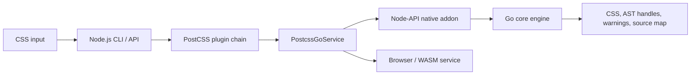
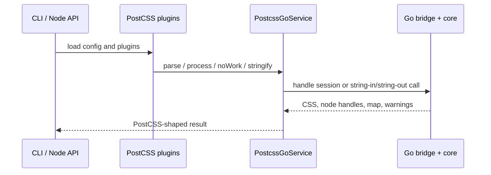

# Architecture

A fast Go CSS engine behind a PostCSS-compatible JavaScript surface. The Go core owns the hot path; Node and browser packages own ecosystem integration.

## System overview



- **Go core** — parse, canonical AST operations, stringify, warnings, source maps
- **Node.js packages** — public API, CLI, plugin loading, and the AST facade required by JavaScript plugins
- **Native boundary** — one private C ABI dispatcher for string-in/string-out work, plus unversioned handle methods for live AST sessions
- **Browser / WASM** — same service contract as Node: a Worker for string-in/string-out work, and a main-thread Go/WASM handle session (`postcssGoHandles`) for live trees

## Processing pipeline

```text
CSS → tokenizer → parser → AST → plugins → stringifier → Result
```

`api.New(...).Process(css, options)` parses input, runs plugin hooks (`Prepare` → `Once` → enter/exit visitors → `OnceExit`), then stringifies. Source-map generation, previous-map composition, and annotation emission are Go-owned. Errors stop the run; warnings accumulate on `Result.Messages`.

On the Node and browser JavaScript surfaces, JavaScript plugins run against Go-owned node wrappers. Native `process` / `noWork` stay string-in/string-out (JSON metadata plus CSS/map text). Live trees never cross the boundary as a serialized AST.

## AST model

Six node kinds: `Root`, `Document`, `Rule`, `AtRule`, `Declaration`, `Comment`. Nodes share parent links, source ranges, and formatting metadata (`Raws`), so output can stay faithful to the input.

The public TypeScript classes in `ast.ts` are the identity skeleton (`instanceof`, constructors, documented methods). Method bodies that touch tree state forward through handle operations into a Go arena. There is no binary AST codec and no second mutable TypeScript tree on the native or main-thread WASM handle path.

## Go packages

| Package              | Responsibility                                                        |
| -------------------- | --------------------------------------------------------------------- |
| `pkg/api`            | Public Go library facade (`github.com/postcss-go/postcss-go/pkg/api`) |
| `tokenizer`          | Lexical scanning                                                      |
| `parser`             | AST construction                                                      |
| `ast`                | Node types, mutation, traversal                                       |
| `processor`          | Plugin lifecycle and orchestration                                    |
| `sourcemap`          | Inputs, locations, previous maps                                      |
| `stringifier`        | CSS output and generated maps                                         |
| `result`             | CSS, root, maps, warnings                                             |
| `internal/asthandle` | Session registry, handle protocol, query and stringify-builder ops    |
| `internal/postcss`   | Assembled core used by native and WASM                                |

The tokenizer never builds AST nodes; the parser never runs plugins; the processor coordinates without owning tokenization or serialization.

## Native Node boundary

```text
TypeScript service → Node-API addon → internal/nativeaddon → internal/nativebridge / asthandle → Go core
```

Two transports share the same Go AST:

| Transport       | Operations                                                                                        | Payload                               |
| --------------- | ------------------------------------------------------------------------------------------------- | ------------------------------------- |
| Handle session  | `handleParse`, field/structure ops, `handleStringify`, `handleStringifyBuilder`, `handleQuery`, … | Session and node IDs; CSS stays in Go |
| Bulk dispatcher | `process`, `noWork`                                                                               | CSS text plus JSON options/results    |

The former bulk `parse` / `stringify` / `stringifyBuilder` frames are removed and reject with “binary AST frames are removed; use handle sessions”. Plugin `Node#toString()` and builder callbacks use handle stringify on the Node thread. Promise `process` / `noWork` still run as Node-API async work; explicit sync APIs call the same Go operations on the Node thread. The old production stdio child-process backend is not shipped.

Worker ownership, async-work cleanup, shutdown, session lifetime, and error translation are specified in the [Node native lifecycle contract](native-lifecycle.md).

## Node.js integration



- **service** — shared async contract
- **native** — addon loading, async-work and sync surfaces; map-option normalization via the private shared helpers bundled into core; live trees interned into a Go arena
- **browser / wasm** — Worker-backed async WASM service lives in
  `@postcss-go/core/browser` and `@postcss-go/core/wasm`. `createBrowserProcessor`
  runs JavaScript plugins on the calling thread against a main-thread Go handle
  session (`postcssGoHandles`). The Worker stays string-in/string-out for
  `process` / `noWork` and as a fallback when `mainThreadAst: false` or the
  main-thread instance fails to boot. Sync APIs, `helpers.postcss.parse`, AST
  string insertion, and `Node#toString()` / `helpers.postcss.stringify` are
  Node N-API only; the WASM plugin path throws `SyncBackendUnavailableError`.
  The `./wasm` export also ships `worker.js`, `postcss-go.wasm`, and
  `wasm_exec.js`. Worker RPC rebuilds structured `CssSyntaxError` from the Go
  ErrorDTO; fatal `runtime-error` / `Worker.onerror` events close the service
  and terminate the Worker. Optional `requestTimeoutMs` rejects hung RPCs.
- **cli** — config, JS plugins, message combining, writing Go-generated CSS and maps
- **webpack-loader** — thin Webpack 5 adapter for options, previous maps,
  warnings, dependency messages, emitted assets, and AST metadata; calls core
  directly without depending on the official `postcss-loader`
- **rspack-loader** — thin Rspack adapter with the same options, previous maps,
  warnings, dependency messages, emitted assets, and AST metadata contract as
  the Webpack loader; calls core directly without depending on `postcss-loader`
- **vite-loader** — pre-transform Vite adapter for CSS, config lookup, source
  maps, warnings, watch dependencies, and emitted assets; prevents duplicate
  automatic PostCSS config execution unless Vite has an explicit PostCSS setup
- **shared** — private dual ESM/CJS helpers for map-option normalization, annotation callbacks, map paths, and map-mode predicates; bundled into core and used directly by vendored compat overrides

JavaScript stays responsible for ecosystem-facing behavior and synchronous JavaScript plugin callbacks. Go handles parse, the canonical AST implementation, process, no-work map handling, and all pipeline/plugin-result stringify and source-map generation. Node plugin helpers that parse or stringify CSS (`helpers.postcss.parse`, `Node#toString()`, builder callbacks) use the N-API Go parser/stringifier; the browser WASM path throws `SyncBackendUnavailableError` instead.

## Source maps

Ownership is split so PostCSS-shaped options stay in JavaScript while map generation stays in Go:

| Layer                   | Owns                                                                                                                                                                               |
| ----------------------- | ---------------------------------------------------------------------------------------------------------------------------------------------------------------------------------- |
| Private shared helpers  | Materialize JavaScript `map.prev` and `map.annotation` callbacks once, then normalize PostCSS-shaped options into flat bridge flags (`mapInline`, `mapAuto`, `previousMapPath`, …) |
| Node / browser / compat | Supply live PostCSS roots to callbacks, expose `PreviousMap` / `ResultMap` facades, surface Go's resolved `mapFile` on results, and write the final files reported by Go           |
| Go `processor`          | Load previous maps, compose or build maps, select inline/external output, emit `sourceMappingURL`, and report the resolved external `mapFile` for process, no-work, and stringify  |
| Go `stringifier`        | AST stringify with optional source-map annotation stripping; raw-CSS `ClearSourceMapAnnotations` for the no-work path                                                              |

Contract notes:

- CLI `processWithGoEngine` and `Processor#process` share the same plugin path: JavaScript plugins run around Go parse/stringifyResult. No second CSS `process` pass is used to compose plugin maps.
- Bridge `mapInline` is optional JSON (`*bool` in Go). Omitted means unset; `false` means explicit external/no-inline. Bare Go `Map: true` with no output-mode flags defaults to inline, matching PostCSS `map: true`.
- `process` with maps off strips only `# sourceMappingURL=` comment nodes. `noWork` without maps uses the PostCSS no-work string cleaner (`/*#` comments).
- Source records stay on the Go nodes. Standalone and plugin-result stringify compose maps in Go via handle `stringifyMap`; `source-map-js` is a test/dev dependency of `@postcss-go/core`, not a runtime dependency.
- CSS-provided external annotations are treated as untrusted: only regular `.map` files confined to the input directory are loaded, with a 32 MiB limit. An explicit `map.prev` path remains a trusted caller option but uses the same file type and size checks.

## Compatibility and performance

**Compatibility** — keep PostCSS-shaped AST and visitors; preserve formatting and source locations; carry source-map options through the processor and bridge; run upstream tests via `packages/postcss-compat`.

**Performance** — keep the core pipeline in Go; prefer the native handle AST for
capability-complete plugin workloads. Measure with the fixtures in
[Contributing](contributing.md) and `pnpm bench:handles`.

## Testing

Tests live next to the code they protect (tokenizer, parser, AST, processor, stringifier, bridge, `@postcss-go/shared`, packages). Prefer the narrowest boundary tests first, then the broader checks from [Contributing](contributing.md).
